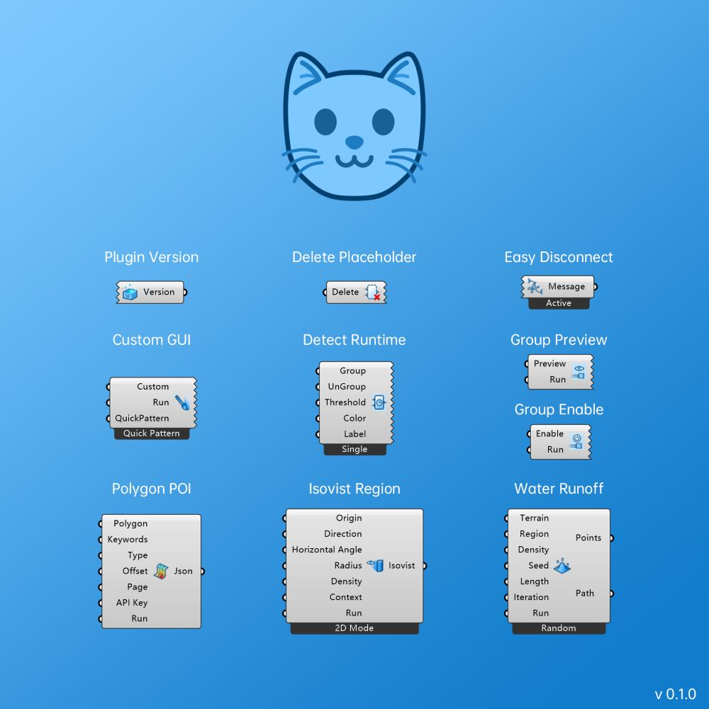

# Capable_Archi_Tool

A small tool I developed during my architectural design course to facilitate analyzing and controlling Grasshopper. (Still work in process)

Current features include:
* Delete placeholder component on canvas.
* Disconnect wire with one click.
* Custom GUI easily.
* Detect component which exceeds time limit.
* Preview/hide or enable/disable a group of components.
* Get polygon POI from Amap.
* Generate the isovist region of a viewpoint.
* Simulate water runoff on terrain.

I hope this tool helps speed up your modeling process and make it convenient to manage elements on Grasshopper canvas. It will be updated periodically with the addition of new features or bug fixes.

Please let me know if you run into any issues while using this plugin.   :)

food4rhino: [https://www.food4rhino.com/en/app/capablearchitool-cat?lang=en](https://www.food4rhino.com/en/app/capablearchitool-cat?lang=en)
